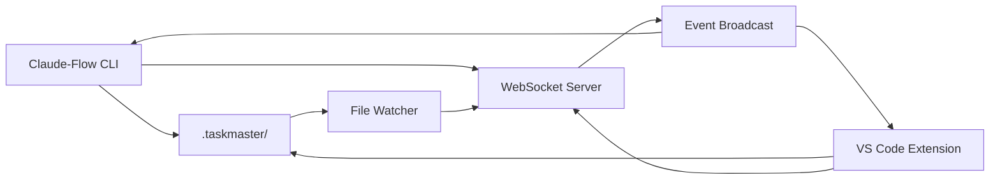

# VS Code TaskMaster Sync Architecture

## Overview
This document outlines the architecture for synchronizing TaskMaster data between Claude-Flow CLI and the VS Code extension, enabling real-time task management with visual feedback.

## Architecture Components

### 1. Shared Storage Layer
```
.taskmaster/
├── tasks/
│   ├── tasks.json          # Primary task storage
│   ├── tasks.lock          # Lock file for concurrent access
│   └── history/            # Task history snapshots
├── config/
│   ├── sync.json           # Sync configuration
│   └── connection.json     # Active connections
├── sparc/
│   └── mappings.json       # SPARC mode mappings
└── logs/
    └── sync.log            # Sync operation logs
```

### 2. Communication Architecture

#### WebSocket Server (Primary)
- **Port**: 5173 (configurable)
- **Protocol**: ws://localhost:5173/taskmaster
- **Message Format**: JSON-RPC 2.0
- **Authentication**: Token-based (optional)

#### HTTP Fallback
- **Port**: 5174 (configurable)
- **Endpoints**:
  - GET /api/tasks - Retrieve all tasks
  - POST /api/tasks - Create/update tasks
  - GET /api/sync/status - Connection status
  - POST /api/sync/event - Push events

### 3. Message Protocol

#### Message Types
```typescript
interface SyncMessage {
  id: string;
  type: 'request' | 'response' | 'event';
  method: string;
  params?: any;
  result?: any;
  error?: SyncError;
  timestamp: number;
}

interface SyncError {
  code: number;
  message: string;
  data?: any;
}
```

#### Event Types
- `task.created` - New task created
- `task.updated` - Task modified
- `task.deleted` - Task removed
- `task.status.changed` - Status update
- `sync.connected` - Client connected
- `sync.disconnected` - Client disconnected
- `file.changed` - File system change detected

### 4. Data Flow



### 5. Sync Strategy

#### Conflict Resolution
1. **Last Write Wins**: Default strategy
2. **Merge Strategy**: For concurrent edits
3. **Manual Resolution**: For complex conflicts

#### Sync Modes
- **Real-time**: Instant sync via WebSocket
- **Polling**: HTTP fallback with interval
- **Manual**: User-triggered sync

### 6. Security Considerations

#### Access Control
- Local-only by default (localhost)
- Optional token authentication
- File system permissions

#### Data Protection
- No sensitive data in logs
- Encrypted storage (optional)
- Secure WebSocket (wss://) support

## Implementation Phases

### Phase 1: Shared Storage (Current Focus)
1. Create .taskmaster directory structure
2. Implement file-based task storage
3. Add file locking mechanism
4. Create atomic write operations

### Phase 2: WebSocket Server
1. Implement WebSocket server
2. Define message protocol
3. Create event broadcasting
4. Add connection management

### Phase 3: CLI Integration
1. Wire up sync commands
2. Add auto-sync option
3. Implement status reporting
4. Create error handling

### Phase 4: File Watching
1. Implement file system watcher
2. Debounce file changes
3. Trigger sync events
4. Handle file conflicts

### Phase 5: Testing & Documentation
1. Unit tests for each component
2. Integration tests
3. End-to-end tests
4. User documentation

## API Reference

### CLI Commands
```bash
# Initialize sync
taskmaster init

# Start sync server
taskmaster sync server start [--port 5173] [--host localhost]

# Stop sync server
taskmaster sync server stop

# Check status
taskmaster sync server status

# Manual sync
taskmaster sync [--force]
```

### WebSocket API
```javascript
// Connect
ws = new WebSocket('ws://localhost:5173/taskmaster');

// Subscribe to events
ws.send(JSON.stringify({
  id: '1',
  type: 'request',
  method: 'subscribe',
  params: { events: ['task.*'] }
}));

// Get all tasks
ws.send(JSON.stringify({
  id: '2',
  type: 'request',
  method: 'tasks.list'
}));

// Update task
ws.send(JSON.stringify({
  id: '3',
  type: 'request',
  method: 'task.update',
  params: {
    id: 'task-001',
    status: 'completed'
  }
}));
```

## Error Handling

### Error Codes
- 1001: Connection failed
- 1002: Authentication failed
- 1003: Invalid message format
- 1004: Method not found
- 1005: File access denied
- 1006: Sync conflict
- 1007: Server shutdown

### Recovery Strategies
1. Automatic reconnection with backoff
2. Queue operations during disconnect
3. Resync on reconnection
4. Fallback to HTTP polling

## Performance Considerations

### Optimization Strategies
1. Batch updates within 100ms window
2. Compress large payloads
3. Use incremental sync for large datasets
4. Implement caching layer

### Scalability
- Support up to 10 concurrent connections
- Handle 1000+ tasks efficiently
- Sub-second sync latency
- Memory usage under 50MB

## Future Enhancements

### Planned Features
1. Multi-project support
2. Team collaboration
3. Cloud sync option
4. Mobile app support
5. Plugin system

### Integration Points
1. GitHub/GitLab webhooks
2. Jira/Asana sync
3. Slack notifications
4. CI/CD pipelines